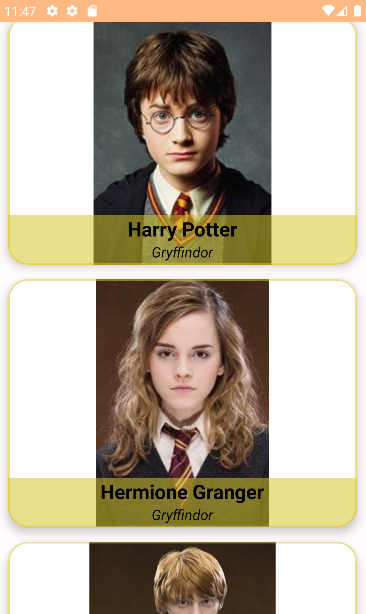
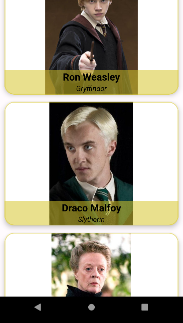
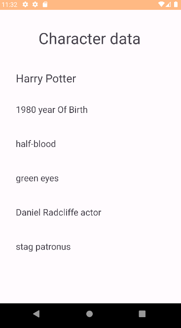

# App list of harry potter characters with Kotlin

* [Retrofit](https://github.com/square/retrofit)
* [HarryAPI](https://hp-api.onrender.com/)

## In the main activity you can see a list of the different characters, with their image in a cardView

 
 

## By clicking on the character item it will give you the data of their respective character

 

The application consists of a recyclerView with a call to the API, which will result in a list of
its characters